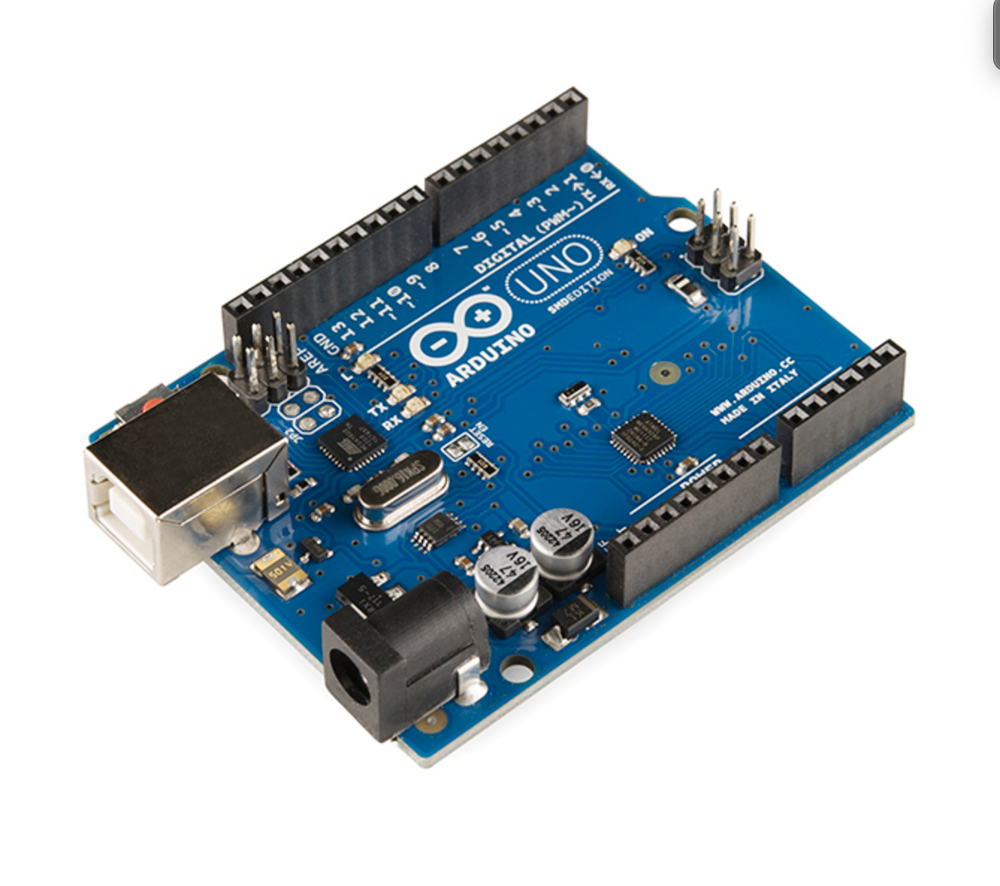

# January 11, 2023 - in class

Doccumentation of in class review

Reviewed several git functions

- commit
- add
- branch
- clone
- fetch
- push

- Added theme to repo

Created class Discord server

Need to get more familiar with Unix, check out Adafruit / Circut playground Express.

Wondering what material wires are used for breadboard - FAB Lab has solid core and stranded wire. Solid core works well for me.
