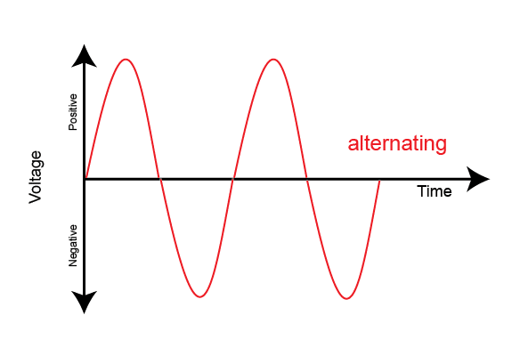
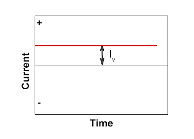
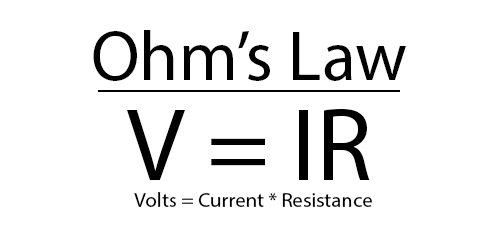
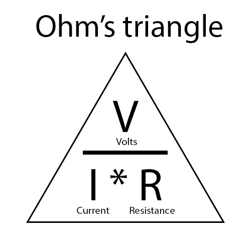
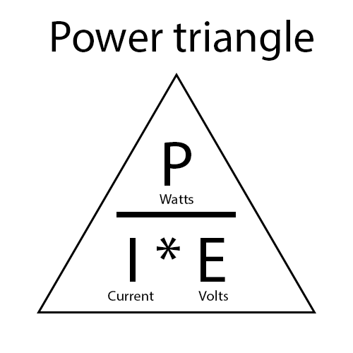

# January 12, 2023 - Electricity Basics

Two main types of electrical current

## AC - Alternating Current

* Type of current running from U.S Wall sockets - 110 Volts, 60 Hz
* Currrent is a wave flowing between positive and negative voltage, rate is measured in Hz

## DC - Direct Current

* Always consistent, does not fluctuate like AC
* Type of current found in batteries

AC Adapters, or Wall Warts, converts AC from wall socket to DC for charging devices, etc.

## Ohm's Law

* Formula for finding converting between Volts, Current, and Resistence
* Volts are measured as such, represented by V, E.
* Current is meausred in amps, represented by A, I.
* Resistance is measured in Ohm's, represented by Omega, R.

## Breadboard Basics

* Ground is 0 Volts, Negative, represented by blue or black
* Positive current is represented by Red
* Numerical rows on the breadboard connect to one another, alphabetical columns do not.
* The Positive and Ground columns are connected on either side of the board.
* The break in the middle of the board splits the current. Battery needs to be patched over to supply power.

## Resistor Color Key

* Colored bands on the resistor note how many Ohm's it is rated for.
* Gold or silver band represents % of accuracy.
* 3 other colors represent value: first and second bands are first and second number, third band is the number of 0's that follow.

| Value | Color |
|------:|-------|
|      0| Black |
|      1| Brown |
|      2| Red   |
|      3| Orange|
|      4| Yellow|
|      5| Green |
|      6| Blue  |
|      7| Violet|
|      8| Gray  |
|      9| White |
