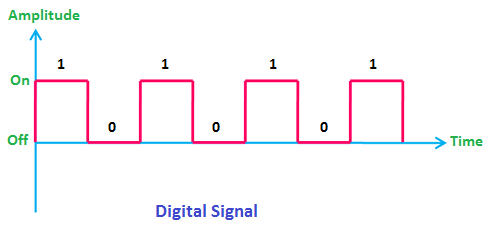

# Jamuary 18, 2023 - in Class

## Interactivity

Started class by discussing interactivity. The main takeaway was that it is important to step away from basic 1-1 call and response. Interctivity, as it pertains to this class, needs to move beyond the basic action of pressing a button and having a sound play or a light turn on. Truly interactive works will consist of multiple parts that function independently and interact with one another.

## New Terms

**GPIO - General Purpose Input/Output** - signal pin on cirrcut board, can be used programmed for input, output, or both.

**IDE - Integrated Development Environment** - Comprehensive software development toolset - VSC, Arduino, etc.

**PWM - Pulse Width Modulation** - reduces average power by subdividing signal into multiple parts.

## Analog vs Digital

### Analog

* Continuous signal, any amplitude

### Digital

* Binary signal
* **HIGH/LOW**, T/F, On/Off

## Input vs Output

### Input

* Microphonee
* Light Sensor
* Switch

### Output

* Speaker
* Motor
* Light
* Display

## Additional Notes

* Thinking about CCTV Cameras as input for future project
* Our microcontroller works on 5v, most take 3.3v
* Usb is 5v
* Check out The Psychology of Everyday Things
