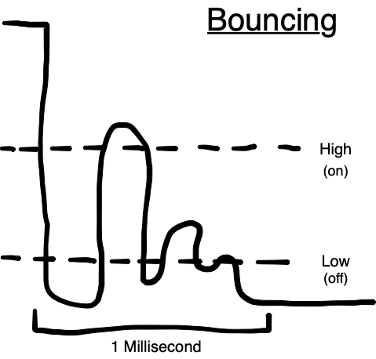
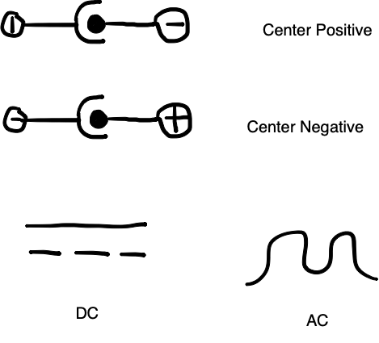

# February 08, 2023 - in class

* Circuts are designed in stages, components are usually grouped for functionality. For instace, the amplification stage.

* Find voltage/ground with continuity test on multimeter (speaker icon)

* Pullup resistors prevent short circut by eliminating floating switches

* Switches tend to **bounce**

* To **debounce** we smooth it out with a capacitor, or account for bounce in software

* To chain multiple parameters in a single if statement, use && for and, || for or.

* Check out [Adafruit.io](https://io.adafruit.com) for data visualization

## Wall Warts

* DC, VDC Out is ideal

* RoHS Compliance means no lead!

### Switching vs Linear

* **Switching:** Regulated, has choppers, voltage is maintained, preferable.

* **Linear:** Not regulated, very unsophisticated, heavy, big magic block of metal, not preferable.
