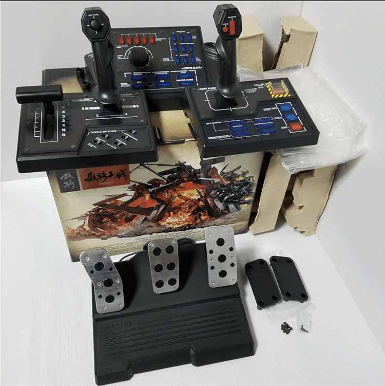
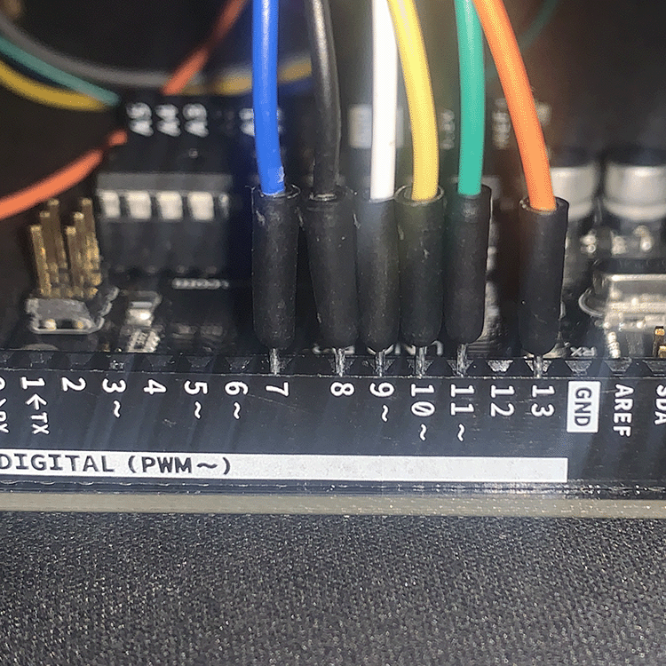
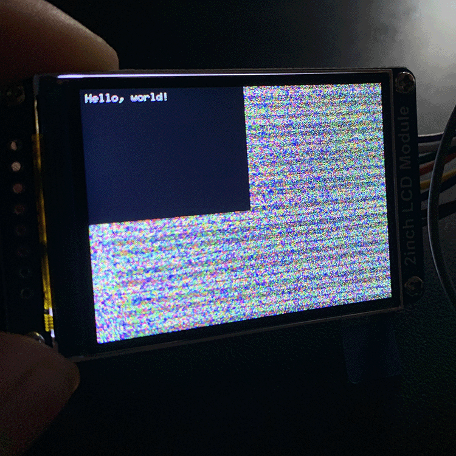
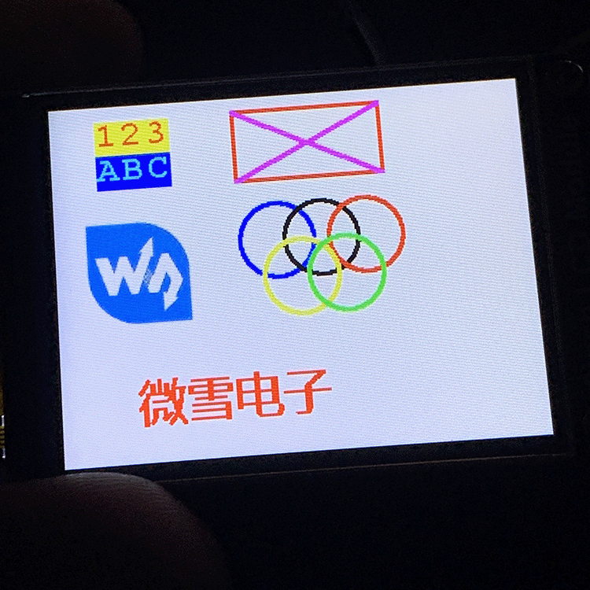
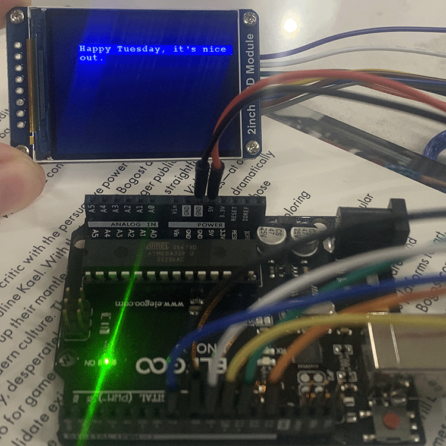

# February 21, 2023 - Midterm Progress Update

After a slower start than I would have preferred, I've made some accelerated progress this week. This entry serves to collect each of my failed, forgotten, and replaced sketches, in addition to presenting my current status prior to our class meeting on the 22nd.

## Working through sketches

I have to admit something: This project has been tough for me. I came into the course with lofty expectations and, truthfully, my head in the clouds. When it came time to start prototyping ideas, it felt like my creative well was completely dried out. It would be easy for me to credit this to my relative unfamiliarity with this approach to art making (my background with interactivity comes largely from my time working at an Arduino-powered escape room during high school), but I also think it is due to how much I was complicating things in my mind. My initial round of ideas relied too heavily on either graphics processing or a convoluted attempt at retro-fitting pre-existing frameworks for game design to work with the arduino. Not productive.

### Sketch 1: Generative City Builder

* This idea revolves around the construction of a sensor matrix upon which a user places 3D printed geometric forms, triggering a procedurally-generated city design to populate a screen.

* Heavy on the fabrication, programming, and graphics processing, little-to-no actual interactivity beyond ``` if sensorPressed(){} ```

* **This will not do.**

### Sketch 2: 2-Player Sensor Deul (Laser Chess)

* As the title suggests, I spent half an hour designing (not) laser chess before recognizing that I was inadvertently copying the real game of the same name. Bummer. While not neccessarily being a problem in and of itself, this makes matters worse when I recognized the electrical, programming, and fabrication gymnastics this project would require.

* Even still, there were some quality ideas present. The idea of using mirrors and solid forms to generate an evolving, high stakes playing environment is interesting, and the actual *lasers* lend themselves to the capabilities of the Arduino.

* Far more interactive than the previous sketch, this was a step in the right direction.

* **Better, but still won't cut it.**

### Sketch 3: Living Tabletop

* Heavily inspired by [Tom Burtonwood's Screen Breach](https://tomburtonwood.com/section/494297-Screen-Breach-Togetherism.html) project.

* Easily the least developed of these initial sketches, this idea revolves around users placing objects upon a surface which is simultaneously being projected on. The idea was for the physical spatial manipulation to trigger animated responses on the tabletop. I know, I know... It was a last resort.

### Sketch 4: Sonically Responsive Rocket

* After introducing circut bent toys to the mix, I began thinking about ways I could use the analog manipulation of a sound device (adding and removing resistance) to trigger arduino sensors or a microphone, which then manipulates a p5js sketch.

* The simplest example is an animated rocket ship whose vertical poisitioning along an axis is altered by pitch changes from the hacked toys. The effect, I would hope, would be a comical, albeit quite annoying, little toy. Simplistic and highly interactive, sure, but also thematically void and quite pointless. Hacking plastic crap to make more plastic crap.

* In a brazen attempt to ressurect this dead-on-arrival idea (is the frustration coming through, reader?), I started thinking of ways I could make it more complex. I thought about using the ultrasonic sensor or a photoresistor to send data to the arduino, then back to the toy. All said, this was a crappy stepping stone on the path towards more interesting ideas.

* Notably, this was the sketch that gave me the idea to enquire about using a dedicated display, instead of a computer running a p5js sketch. With that said, things began to look up.

### Sketch 5: The Death of Reason: (or) The Time Craig Wanted to Build a Rocket

* Leaving logic, theme, concept, and rationality at the door, I started to brainstorm what I thought the *coolest* thing I could make might be. Give me a break, I was out of ideas, very nearly out of time for ordering stuff of the internet, very desperate, and just so happened to be listening to the [Insert Credit Podcast](https://insertcredit.com). This is where I first caught mention of a game called *Steel Battallion* and, far more importantly, its ludicrously complicated, unashamedly dorky controller.



* Yep. You're reading this right. I was going to do what Capcom couldn't. I was going to make a (totally not useless) giant plastic modded keyboard that works slightly less than and costs exponentially more than a USB Flight Stick.

* Alright, sure. My sketch was a whole lot less complicated than that, but the problem was simply that I was trying to make an interface for a program that didn't exist. Adding as much "interactivity" as I could think ("oh, wow! the button is glowing! I should press it!") without a shred of an idea what it was all for. Although.... The idea did lead me to the question which would eventually pull me out of these dark, dark times. I wanted it to have an embedded screen. *Cue divine intervention.*

### Sketch 6: Oh Yeah! Now we're getting somewhere (virtual pet)

* TFT! **TFT!** Folks, let me tell you about a little something called TFT... Like a beam of heavenly light pouring from the clouds, these cheap-as-dirt little screens entered the equation. The possibilities felt endless. The project started to materialize. I was going to build a virtual pet that responds to real world conditions, has animations that trigger based on-

* Crap.

### Sketch 7: With all that said, where are we now?

* There will be no animations. There will be no needlessly complicated interactivity for the sake of it. After much trial and error, I settled upon my current concept. Using basic drawings, creative hacking of screen-clearing and a slow refresh speed, and lots of text, I want to create an experimental narrative. The basic idea is that the user "stumbles upon" a cyllindrical object, resmbling a small telescope, with a small opening on one side. When they peer in, they will be greeted by text on the screen, addressing the user directly. Using a button and an ultrasonic sensor, the user will be able to trigger reactions from the "sentience" inhabiting the object. Whether they follow its directions and aid it on its questionable quest, or will they reject it entirely?

## Progress Update

With the TFT in my possession, I used the [WaveShare Wiki Entry](https://www.waveshare.com/wiki/2inch_LCD_Module?Amazon#Arduino_Software_Description) on connecting the TFT to the Arduino and got the hang of the basic functions and capabilities of the tft









As of now, my primary goal is to migrate from the Arduino IDE over to VSC, which will require me to move the LCD Driver and GUI Paint .cpp and .h files over to VSC. After that, I'll integrate the ultrasonic and button functionality into the same project.

Simultaneously, I will continue exploring different methods for housing the project. Currently, I'm looking to modify a smartphone VR attachment so that one lens magnifies the display while the other is removed so that the user can still see their surroundings.

More updates to come soon.