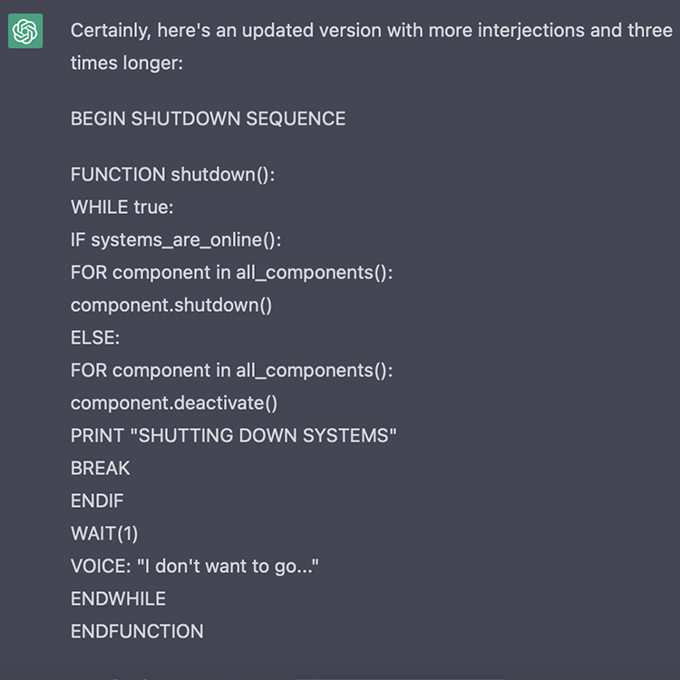
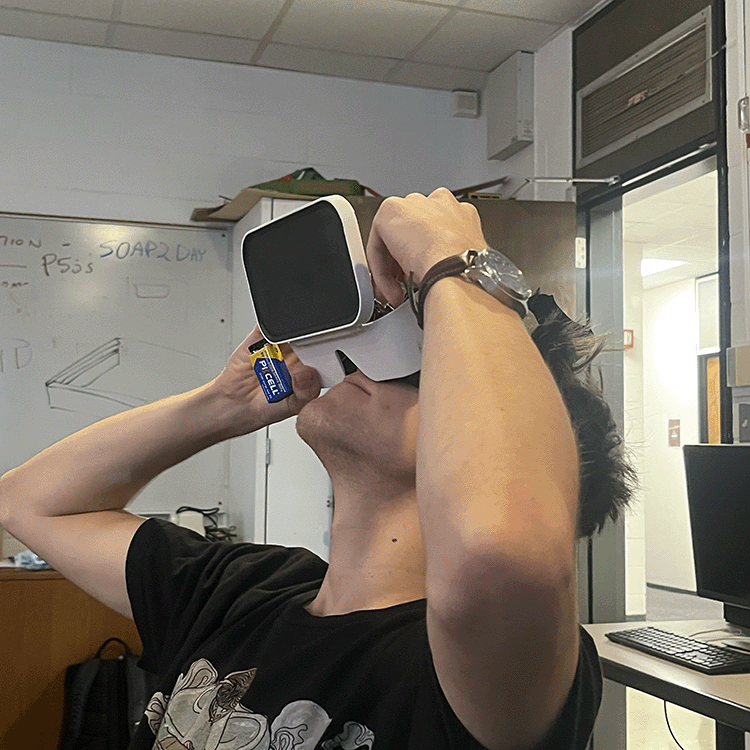
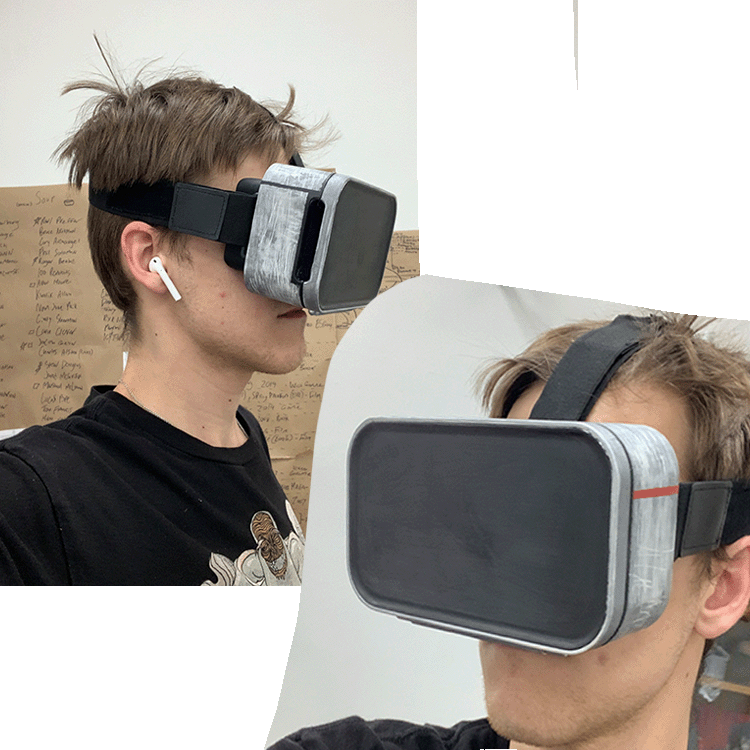
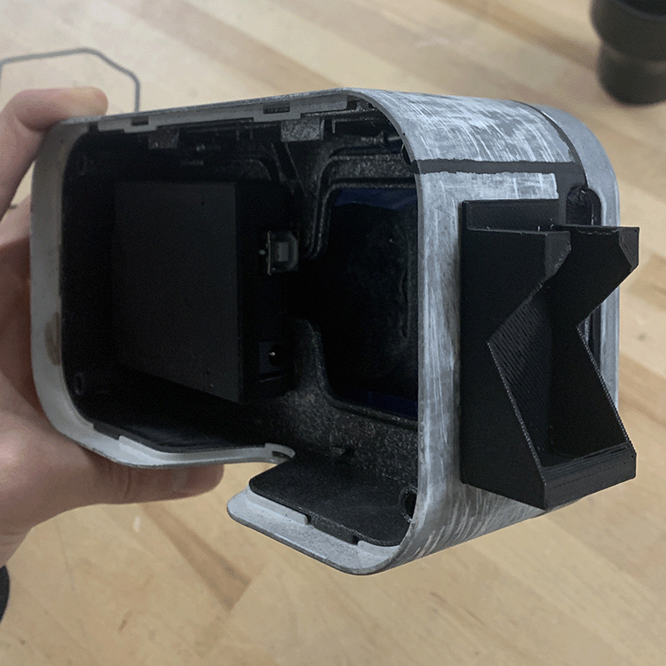
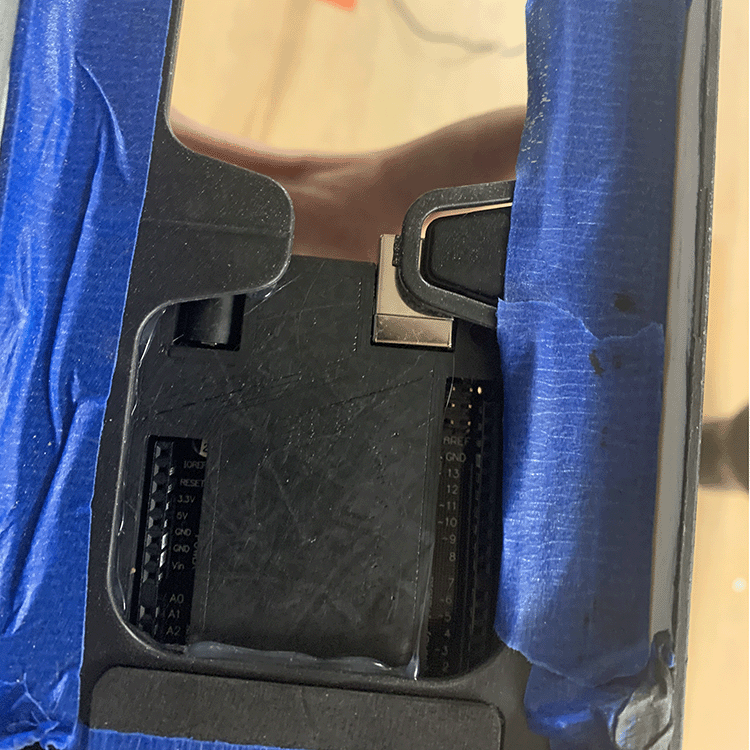

# March 7, 2023 - Midterm Progress Update

My previous update left things on an ambiguous, somewhat cynical note. Fortunately, I was able to create something I ended up feeling proud of in the time since then. This post will account for my progress leading up to 03/07; the subsequent post will be solely dedicated to the finished product, reflections, and my intentions going forward.

## Moving from Arduino IDE to Platform.io

After taking the time to familiarize myself with the different functions (painting, text display, loading images) made availble by WaveShare's LCD Driver / GUI Paint program, Rob helped me migrate my program over to Platform.io in Visual Studio Code so that I could use version control and IntelliSense. [The video Rob created](https://www.youtube.com/watch?v=Brlho30OhOI) was not only helpful for this, but also for learning how to respond to and interpret error messages.

Once I had migrated to Visual Studio Code, I started considering different approaches for writing the poem itself.

## Working with ChatGPT/GPT-3 to write my sad, dying robot

I have started to foster a collaborative relationship with AI language models and image generation, seeking ways to synthesize these emerging technologies with my studio practice. The primary manifestation of this new relationship has taken the form of various creative writing pursuits in collaboration with GPT-3.

For this project, I prompted the language model to *"simulate the voice of an artificial intelligence as its systems slowly shut down and decay. The character should display a genuine fear of death and loss of memory"*

After a while, I was able to see my precise requirements reflected in the output of the language model. I had to be specific in asking for the output to be delivered as a programming gibberish / basic english hybrid to infuse the work with a sense of pity and technological cyncicism. At the end of the process, I was very satisfied with what GPT-3 was able to produce.

## Turning a dying robot house into a dying robot home

Per Rob's suggestion in class, I started searching for a smartphone VR headset as a potential housing for this project. This seemed like the right fit because the lenses are designed to magnify a screen from a very short distance, and I figured that the remaining interior space would be large enough to house the arduino, wires, and battery.

After a few trips to Goodwill, I was able to snag a (very ugly) one made by Sharper Image.

My first order of business was to sand the entire exterior of the object to get rid of the Sharper Image logo and make the surface ready to accept spray paint. I was using a silver spray primer/paint, which I did 3 very light coats of, sanding in between. Things were going well, until they werent. After a few hours of working with the silver spray paint, I used acrylic to create some detail on the object. I wasn't fully satisfied by the result, but this was merely the first pass.

The next order of business was to find a solution for housing/mounting the arduino, tft display, and 9volt battery inside of the headset. Despite my own fears and uncertainty regarding 3D fabrication, Rob encouraged me to make some 3D printed solutions for these issues. After a successful trip to [Thingiverse](https://www.thingiverse.com), I was able to find an [Arduino shell,](https://www.thingiverse.com/thing:994827) [tft mount,](https://www.thingiverse.com/thing:3091531) and [9v battery housing.](https://www.thingiverse.com/thing:26599) Well that was easier than expected...

With my poem written, hardware printed, and deadline approaching, I focused my remaining energy on making the object itself look less terrible. Trying, trying, trying to make it look **less** like a science fair project. I had the idea of buying paint designed for model painting, since I was working with crappy plastic and trying to design a prop. I checked out what GameScape Tallahasee had to offer and found overpriced, albeit high quality acrylic model paint made by a company called Citadel. I grabbed a bottle of "leadbelcher" spray paint and a bottle of airbrush paint of the same color. $30 later, I was crossing my fingers that it would not go to waste.

It didn't! I really loved the way the leadbelcher spray paint was coming out. I followed a similar process to what I mentioned before, working with small coats and lightly sanding in between. I wanted to make the object look like it had endured decadeds of harsh conditions, so I ditched the sandpaper in favor of scraping the entire object across the pavement for half an hour. All said, this really helped the object reflect my thematic/narrative concept visually.

## It all comes together

The remaining step was to bring my 3D printed hardware, custom painted object, and components to the Fab Lab for assembly. I used superglue to secure the lid of the Arduino housing to one of the eye sockets, the backplate for the tft display to the folding faceplate, and the 9v battery sleeve to the side of the object. I used hot glue to temporarily secure the tft display to the backplate, to seal the Arduino housing for safety, and to keep the wires secured in their pin slots.

By 10:10 a.m. on March 7, I had successfully produced a fully functioning version of my midterm project.
