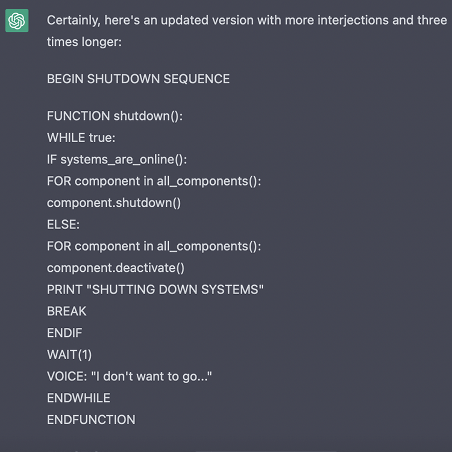

# March 7, 2023 - Midterm Progress Update

My previous update left things on an ambiguous, somewhat cynical note. Fortunately, I was able to create something I ended up feeling proud of in the time since then. This post will account for my progress leading up to 03/07; the subsequent post will be solely dedicated to the finished product, reflections, and my intentions going forward.

## Moving from Arduino IDE to Platform.io

After taking the time to familiarize myself with the different functions (painting, text display, loading images) made availble by WaveShare's LCD Driver / GUI Paint program, Rob helped me migrate my program over to Platform.io in Visual Studio Code so that I could use version control and IntelliSense. [The video Rob created](https://www.youtube.com/watch?v=Brlho30OhOI) was not only helpful for this, but also for learning how to respond to and interpret error messages.

Once I had migrated to Visual Studio Code, I started considering different approaches for writing the poem itself.

## Working with ChatGPT/GPT-3 to write my sad, dying robot

I have started to foster a collaborative relationship with AI language models and image generation, seeking ways to synthesize these emerging technologies with my studio practice. The primary manifestation of this new relationship has taken the form of various creative writing pursuits in collaboration with GPT-3.

For this project, I prompted the language model to *"simulate the voice of an artificial intelligence as its systems slowly shut down and decay. The character should display a genuine fear of death and loss of memory"*

After a while, I was able to see my precise requirements reflected in the output of the language model. I had to be specific in asking for the output to be delivered as a programming gibberish / basic english hybrid to infuse the work with a sense of pity and technological cyncicism. At the end of the process, I was very satisfied with what GPT-3 was able to produce.

## Turning a dying robot house into a dying robot home

Per Rob's suggestion in class, I started searching for a smartphone VR headset as a potential housing for this project. 