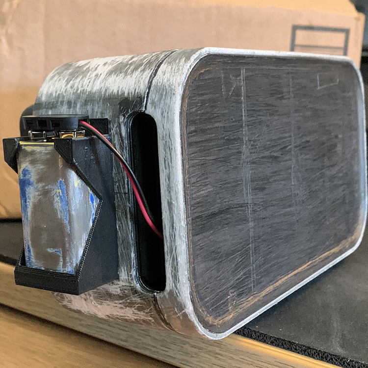
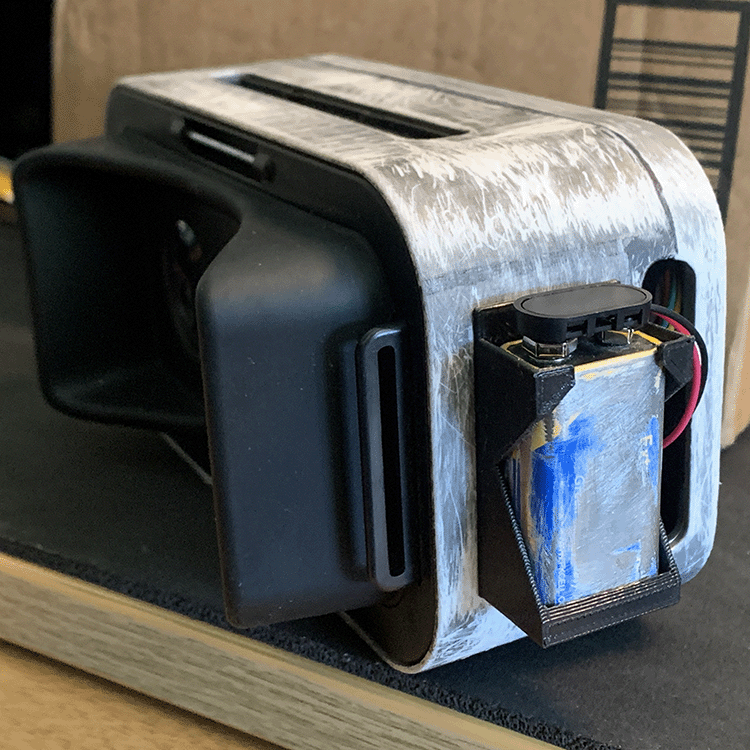
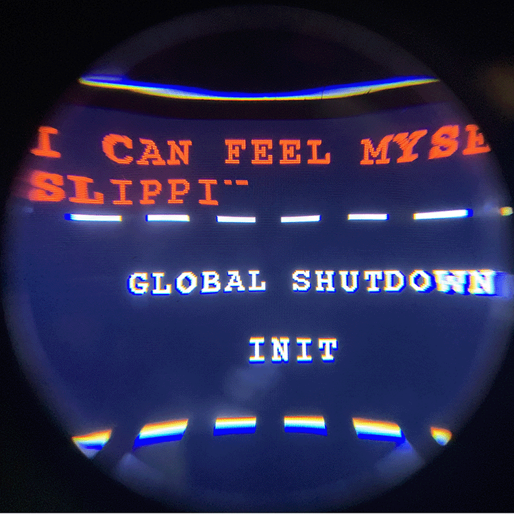
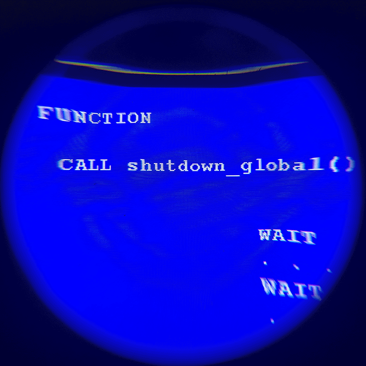
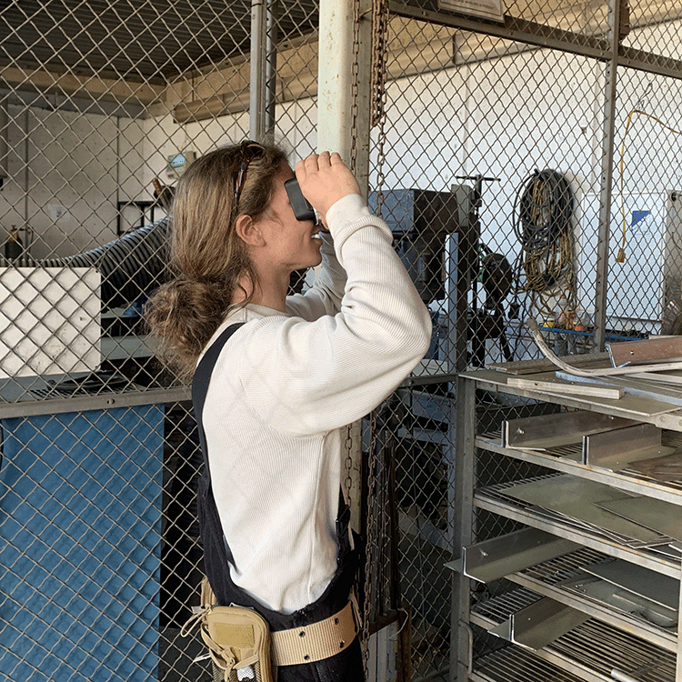
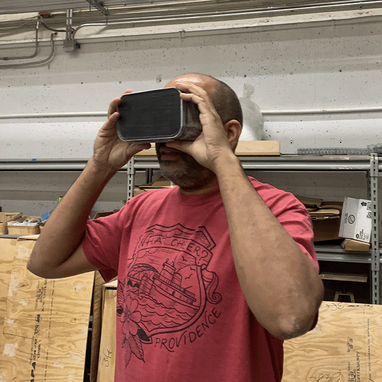
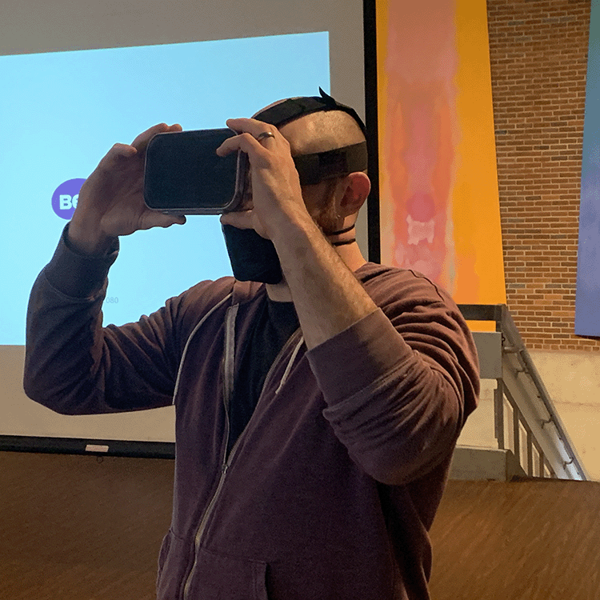

# March 20, 2023 - Midterm Complete

## shutdownSequence()

<>

Overall, I grew to be satisfied with the simplistic design of the headset itself. Although I wish I had been able to incorporate more details, I think that this version does well to house the technology and enable the user to focus on the content held within instead of trying to track what each decorative aspect might mean. Going forward, I would like to look into opening up one of the eyes to give a disorienting passthrough effect. This was a part of my original idea, but was sacrificed in favor of housing the Arduino.

Where I still harbor some dissatisfaction regarding the look of the headset itself, I feel entirely at peace with the poem housed within. I think that the mix of pseudo-code written by ChatGPT and my own personal ideas for the "voice" of the sentience blended to create a convincingly cold, solemn atmosphere. After hearing the feedback of my coworkers at the Innovation Hub, artist Evan Meany, and our class, I think that the poem itself is the strongest aspect of shutdownSequence().

### *Bronson*

### *Rob*

### *Evan Meany*
