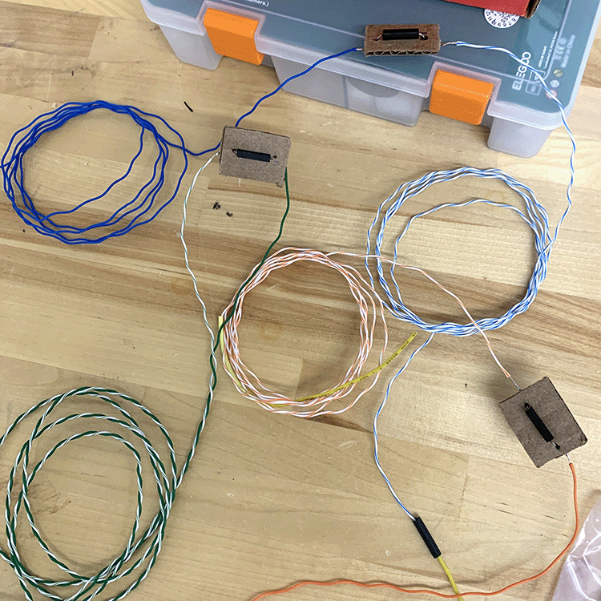
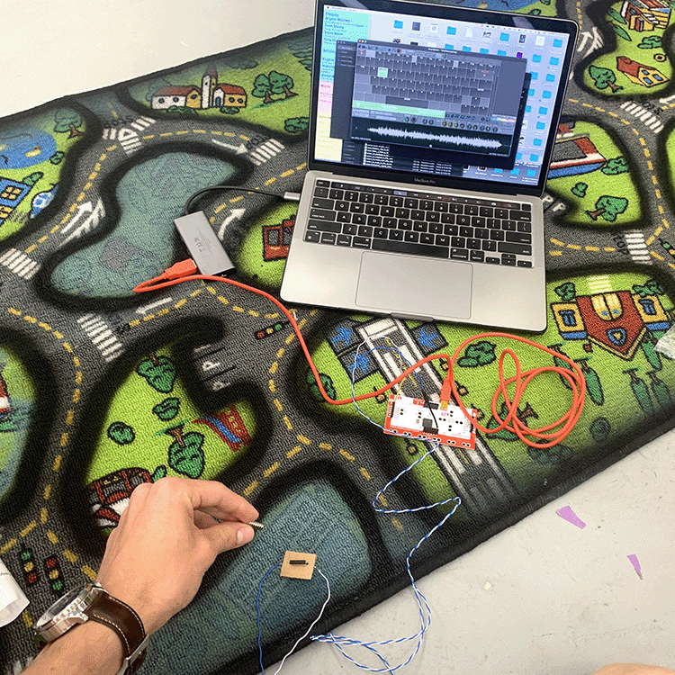
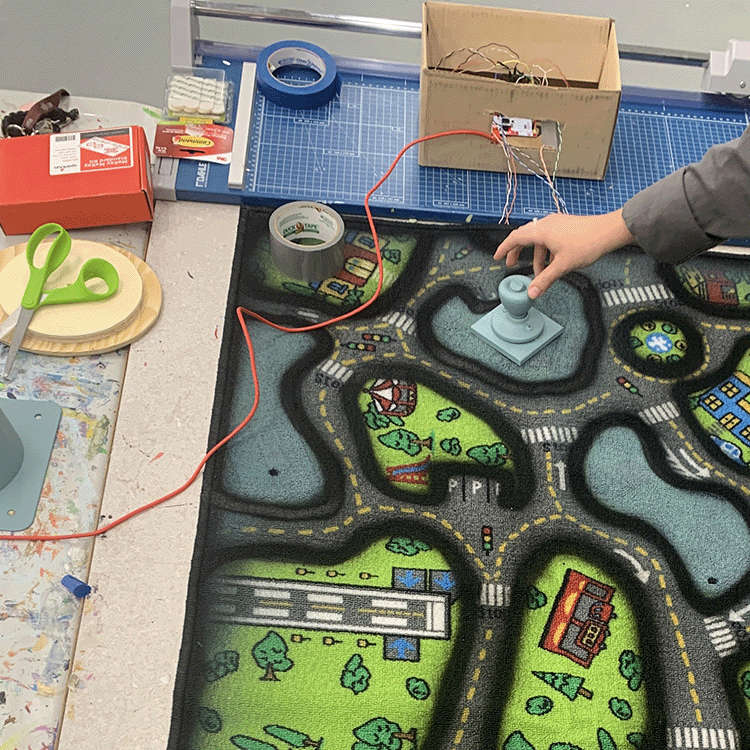
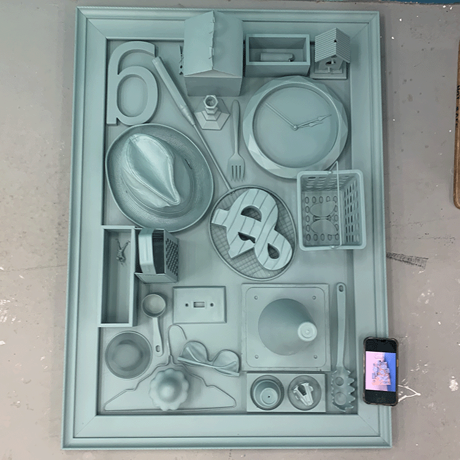

# April 25, 2023 - Final Project Progress Update

## Switching to Soundplant and Makey Makey

With the reed switches working, Grace and I started to more specifically consider what kind of sounds and effects we were interested in implementing. We quickly realized that the primary function we needed was for the sound to play for the duration of the switch being pressed, and then to shut off when the switch was no longer pressed.

Per Rob's reccomendation, we checked out [Soundplant](https://soundplant.org), a keyboard-based sample triggering program. After throwing a few sounds in, we realized that this UI provided all of the functionality we were looking for. However, using Soundplant required that we make the Arduino act as a keyboard. To do this, Rob suggested that I download the Arduino keyboard firmware and a flip program, which unfortunately wasn't optomized for Mac. After much trial and error attempting to get the flip program working, we shifted gears.

Instead of swapping the Arduino firmware, we opted for a microcontroller designed to be used as a keyboard: the [Makey Makey](https://www.youtube.com/watch?v=rfQqh7iCcOU). I tested a reed switch on a breadboard with the Makey Makey in Soundplant and it worked, so we went ahead with this plan.

## Facing my Fears - Time to Solder

I ordered a [pack of reed switches](https://www.amazon.com/Gebildet-Normally-Induction-2-5mm×14mm-Multi-Use/dp/B07YFBQ4HS/ref=sr_1_4?keywords=reed%2Bswitch&qid=1681305623&sr=8-4&th=1) from Amazon, which I planned to solder to scrapped ethernet wire so that we would have enough length to secure the switches under the play rug we were using as our surface. I punched holes in small cardboard squares for support, and then soldered the ends of the ethernet wire to either side of the reed switches. I then soldered a short length of solid wire to the end of the other side of the ethernet cable to create a reliable male pinhead to be plugged into the makey makey.

All things considered, this went very smoothly. I soldered eight of the switches, knowing that we were planning on using six, just in case.

The next step was to test these newly wired switches with the rug itself. Fortunately, this worked without complication, which gave us the greenlight to embed the magnets in the objects, finish compiling the rug, and finalize the sounds.

## The Sounds of Success

There were certain sounds that Grace and I had elected to use several weeks ago, like samples from a found 45 of a local chourus singing *Springtime in Tallahassee,* but there were many that were still yet to be decided. Grace outlined several of their ideas and suggestions in a [blog post](https://gracethorn.github.io/gracesblog/FinalProjectShare.html), which served as a jumping off point for my search for samples.

We quickly decided that we would be working on a sound collage, as opposed to a quantized beat, which forced me to think outside the box and use samples as a means of creating atmosphere and tone. I was interested in Grace's suggestion to use recognizable, repetitive sounds like the spinning Wheel of Fortune and Animal Crossing voices, which I knew I would be able to easily manipulate. I sampled several found 45s, but found very little of this material usable for a non-quanitized beat. Frequent collaborator and Orlando-based composer Michael Mortilla had recently made me aware of the [BBC Sound Library](https://sound-effects.bbcrewind.co.uk), which I used to search for various crowd sounds. The rest of the sounds were sourced from YouTube.

### The Final Lineup

* *Springtime in Tallahassee* - sampled from found 45' - Slowed down and looped

* Animal Crossing Dialogue Sound - YouTube - slowed down

* Wheel of Fortune Spin - Youtube - sped up

* Dialogue from *Autumn Sonata* - Youtube - looped

* Preschool - BBC Sound Library - looped

* Applause - BBC Sound Library - looped

## Assembly

With the reed switches soldered and working with the Makey Makey, Grace and I went ahead and secured the switches to the bottom of the rug. We reinforced the parts of the rug near the switches with cardboard, which was soft enough to not feel out of place. Grace cut small wood bases for each of the interactive objects, on which we secured small magnets after testing the rug with the wired switches.

At this point, the only thing left to do was secure the objects on the board with velcro (this is a temporary solution).

Next, we get feedback at critique.
