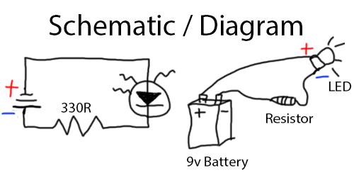

# Lab 1 - Flashlight - Jauary 12, 2023

Using breaboard, 9v battery, resistor and wires to illuminate LED in first circut

## Prep / Notes

* Resistors are not polarized
* Gold stripe = 5% resistor
* Black, Brown, ROYGBV, Gray, White; 0-9

### LED Layout

* Big piece of metal (anvil) is on negative side
* flat side is negative (not always on bigger LED's)
* Shorter leg is negative (not always)

## Process

* Drew schematic and diagram of planned circut

* Built circut - few complications

* Before connecting battery

## Result

* After studying videos/pdf and taking detailed notes, I had success on the first attempt

## Conclusion

* It was a relatively simple process to get this circut working
* The LED did seem a little bit dim, was there too much resistance?
* How do electricians know how much current a component can recieve? It is known that an LED can only take so much incoming power- is stuff like this standardized?
