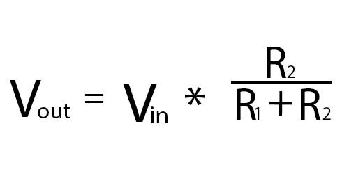
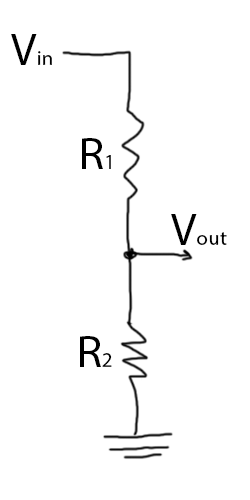
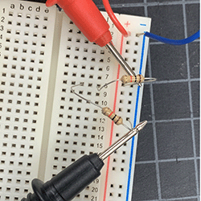
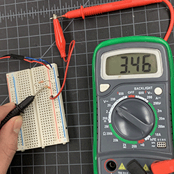
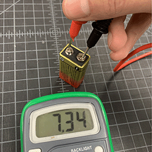
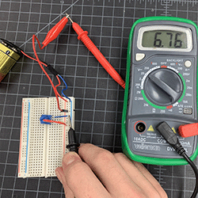
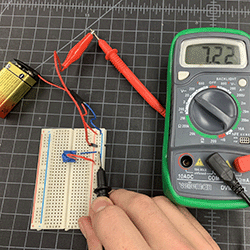

# Lab 2 - Voltage Divider - January 12, 2023

Creating voltage dividers using resistors and a potentiometer, measuring the output with a multimeter

## Prep

* Using the voltage divider formula and calculator, I worked through the five problems listed in the pdf as a preliminary excercise.

* I ended up recreating the fourth problem as my second lab excercise.
* Since the kits did not have any 1K resistors at the time I did the lab, I supplemented them with 330R resistors for the excercises.
* Drew up a schematic of a voltage divider for my notes.

* I sat down with the kits and began assembling my first voltage divider using two 330R resistors.

## Process

My first goal was to get an accurate reading of a 9v battery divided by two 330R resistors.

* At first, I thought I had made a mistake in the construction of my circut. After asking the class Discord, I took a reading of the 9v battery by itself, realizing that it was not outputting a consistent 9v current.

* With that said, my inital reading of 3.46v was accurate and my 330R divider was successful.
* Next, I wanted to try working with the potentiommeter. I noted that the three metal teeth on the potentiometer are meant for (when seen from above) ground, output, and Vcc, from left to right.
* Having learned that, I made my best guess at how that might look in application, and was able to create a successful voltage divider using a potentiometer.
* This was a successful reading with the potentiometer turned all the way down

* And here is a reading with the potentiometer turned all the way up

## Result

* By the end of this lab, I had created a handful of successful voltage dividers.
* I think that there is room for improvement on my end and I intend on recreating this lab with my own kit in the near future.

## Conclusion

* I have to admit that this lab frustrated me at times. There were variables that were out of my control (the dying battery threw my math skills through a loop; thank goodness for calculators!) that made it difficult to coherently track the precise effects of my actions.
* However, I do think that it was an effective learning experience as I refamiliarized myself with the scientific process and adapted to external factors presented to me.
* I know that no project works on the first try, and this lab reminded me why it's important to fail faster so that mistakes can be learned from.
