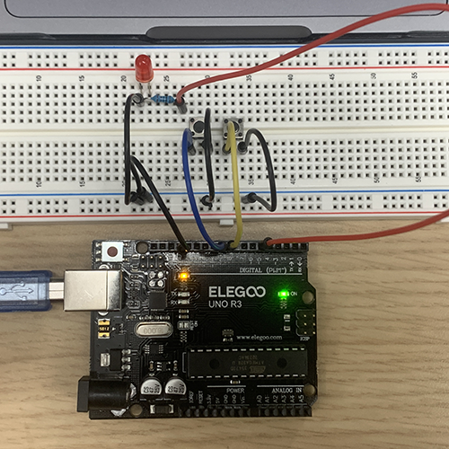

# Lab 3 - Digital Inputs on UNO R3 - January 18, 2023

Using push buttons with digital inputs to turn LED on/off

## Prep

* I started by familiarizing myself with the materials listed in the lab pdf, learning about the mechanics of a push switch and copying the schematic for it.

* I also took note of VSC's auto formatting shortcut; *shift + option + F*

## Process

* Copying the code from the lab pdf, I made an effort to interpret each line, rather than blindly copy/pasting, making comments along the way. The effect was a code that, while borrowed, still makes structural sense to me.

* The function in setup uses the PULLUP command, which reads when there is nothing connected to the input and pulls it up to HIGH.

* The code is designed so that pressing the button will pull LOW using an if statement that calls on both of the buttons constantly.

* Next, I started working on building the breadboard circut with the help of the diagram, which came together quickly.

* Next, I thought, would be the seamless process of uploading the code and testing my circut. Unfortunately, I kept recieving an error message.

* Complicated as it seemed, this error was due to the simple fact that my arduino was not plugged in. Sigh.

* With that resolved, I was able to successfully upload my code to the controller.

## Results

* Fortunately, my code and breadboard circut worked on the first try!

* Both of my buttons performed their intended task, the LED was turning on and off as was supposed to happen, and nothing blew up!

## Conclusion

* At the end of this lab, I am still left with a few specific technical questions.
* Why don't sides A/B have to be connected to anything for the push switch to work?
* Is there a specific process for selecting PWM pins for specific tasks?

* Overall, the most trouble I had completing this lab was when I failed to plug the controller in. Thanks, Craig!
