# Lab 4 - Analog Inputs on UNO R3 - January 26, 2023

Covering the basics of using analog inputs with the Uno R3

## Prep

* I started this lab by familiarizing myself with some vocabulary. The [Sparkfun](https://learn.sparkfun.com/tutorials/serial-communication/all) website has a great tutorial outlining the difference between Serial and Parallel interfaces- the latter sends bits of data sequentially, one after the other, while the former uses an array of wires to transport. I found the following schematic very helpful in visualizing this process.

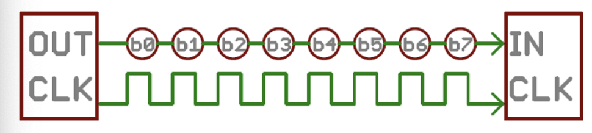

* With a deeper understanding of the vocabulary, I read over the entire lab doccument again before getting to work on the first excercise.

## Process

### 1: Serial Output

* I copied the code from the lab doccument, built it and uploaded it without any problems.

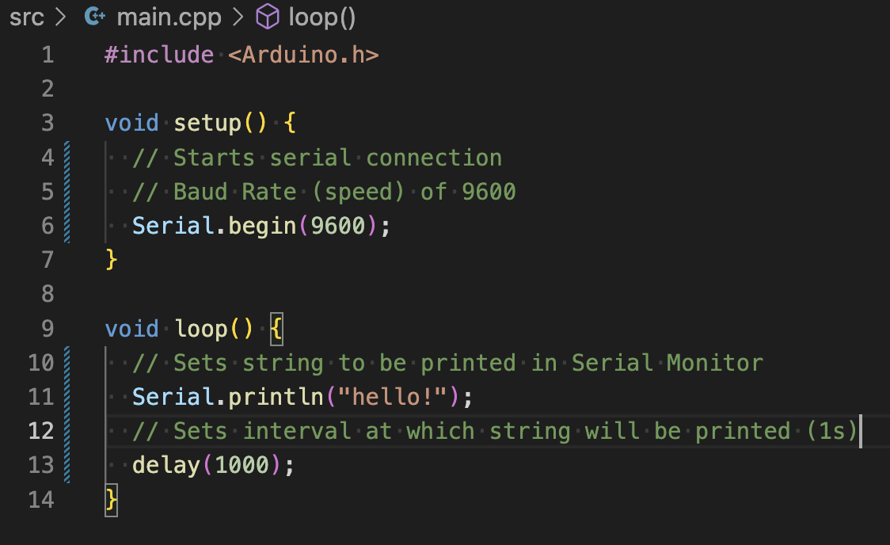

* The Serial Monitor printed "hello!" once per second.

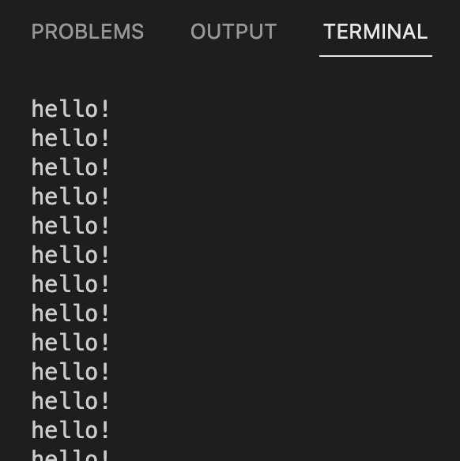

* Taking the time to study each of the functions in the code, I took note of a new term/unit: **Baud Rate:** Unit of measurement for symbol rate, in this case, 9600 bits per second. I still have more questions about this, but for the sake of the lab, an intuitive understanding will do.

### 2: Voltage Divider

* To assist with the process of rebuilding a voltage divider, I was able to refer back to my previous blog post for guidance, imagine that!

* I opted to build the voltage divider using two 1k ohm resistors.
  
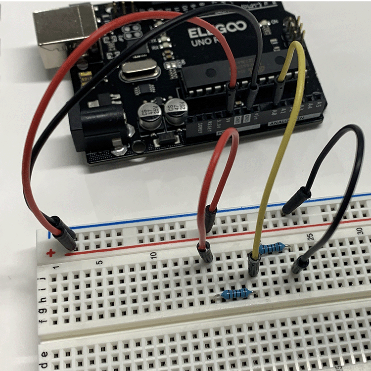

* With the breadboard built out, I copied the code, taking the time to add my own notes in an effort to understand what it's doing.
  
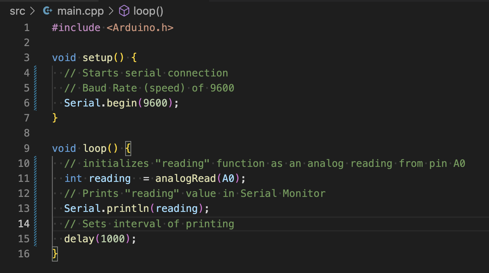

* After building and uploading, I had what looked like success, although I couldn't be sure until I converted the analog reading to volts.

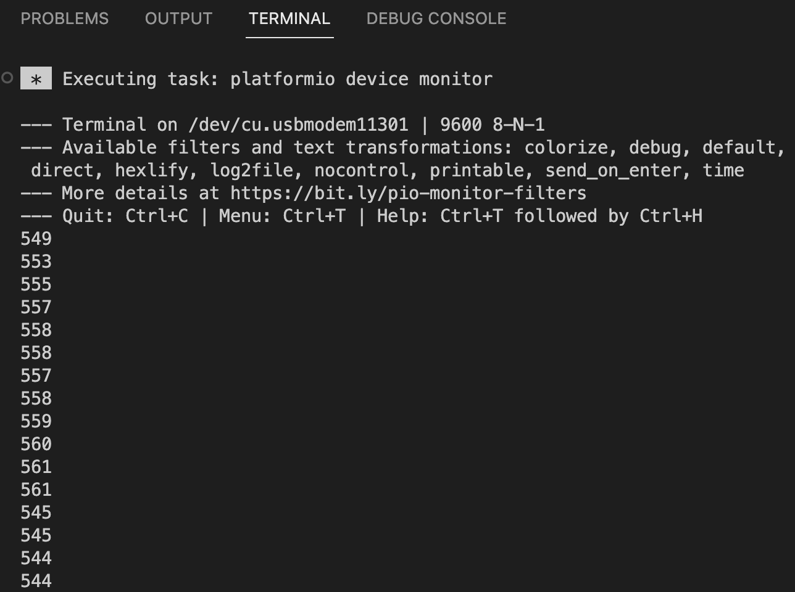

#### 2.5: Showing Volts Instead

* I copied the new "float" line of code and moved it around until I found the right place for it, which was after "reading" was initialized, but before the Serial Monitor is told to print "voltage"
  
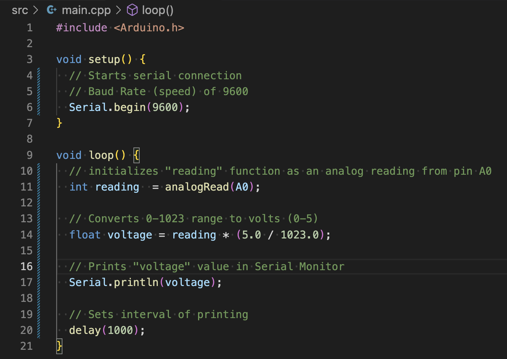

* With the new conversion code installed, I uploaded it to the controller and had success.

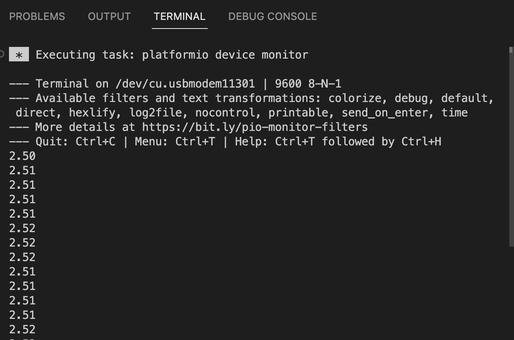

* Finally, I copied the print code to display both "reading" and "voltage" in the Serial Monitor
  
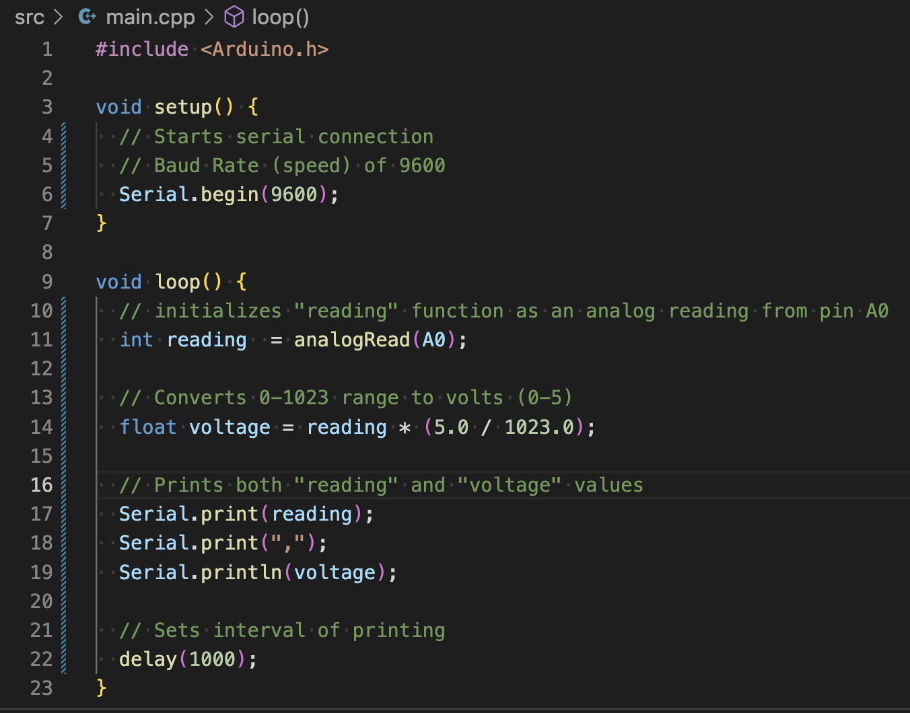

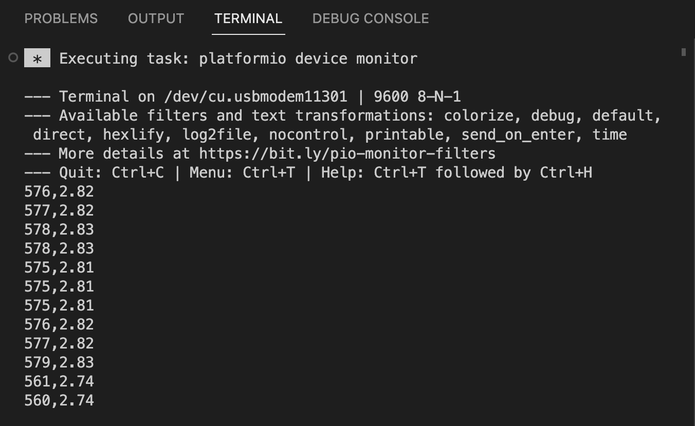

* From what I can gather, println is used to finalize a list of print requests. I think it means "print line"

### 3: Potentiometer

* I started by modifing my breadboard to use a potentiometer instead of resistors

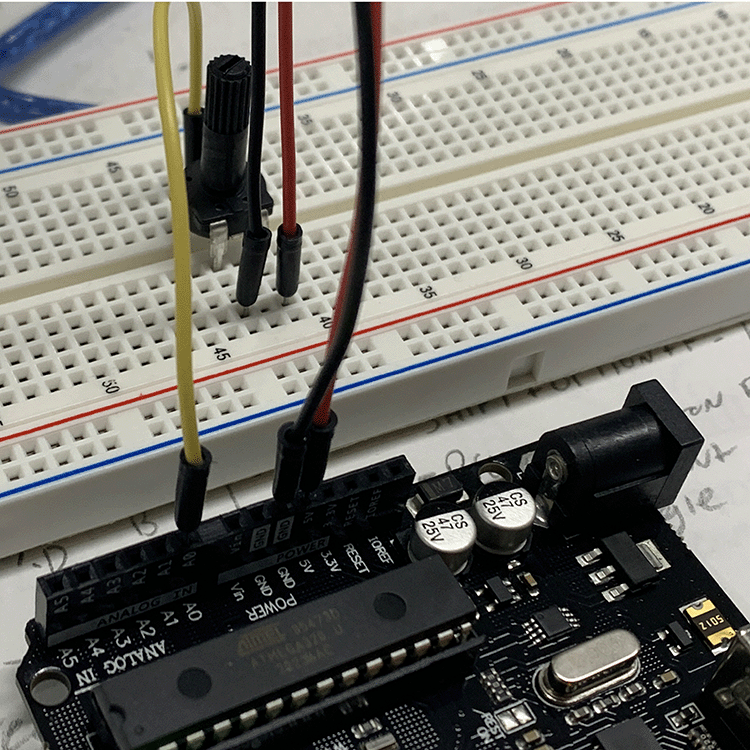

* Uploading the same code as in Excersise 2.5, the Potentiometer Voltage Divider worked on first try. It was turned all the way down to start. I turned it all the way up, then gradually reduced it to zero as seen in the Serial Monitor
  
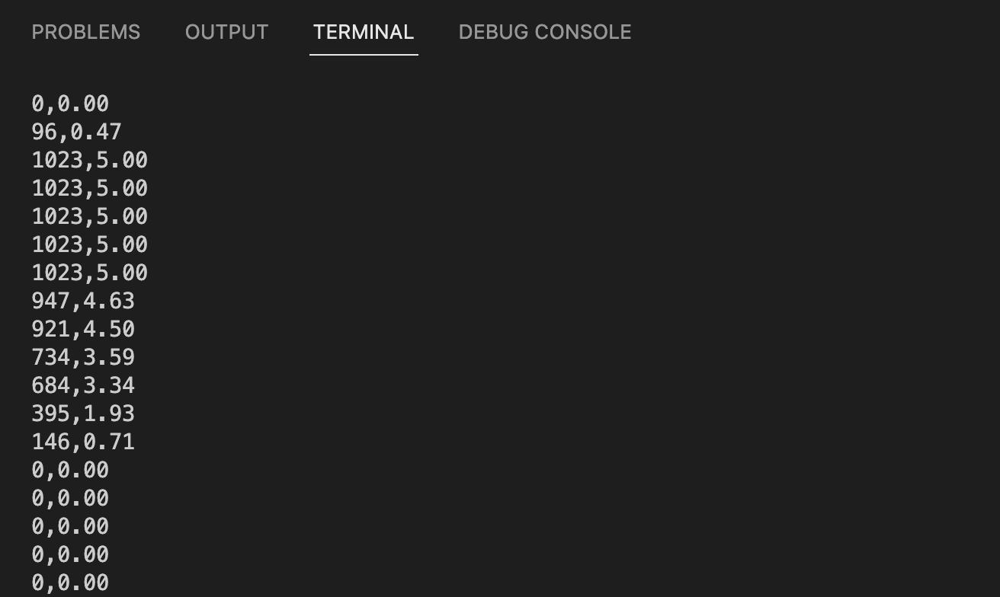

### 4: Controlling the Brightness of an LED

* The lab doc suggested leaving the previous circut in place, but I decided to make some modifications for the sake of usability.

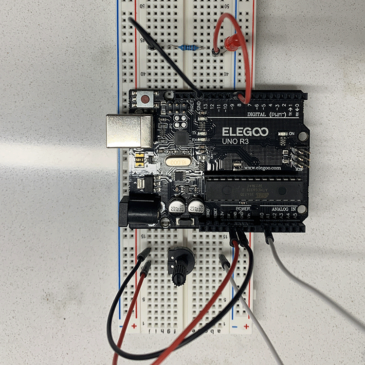

* I copied over the new bit of code, noting how the analogWrite function uses Pulse Width Modulation to simulate an analog signal to dim the LED

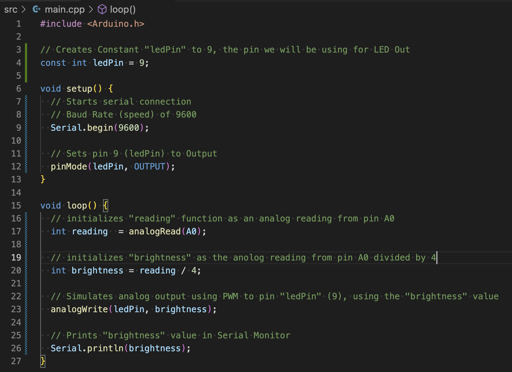

* I think that we divide reading by 4 to give the LED a signal output that wont overload it. We know from the first excercise that the signal from A0 provides values ranging from 0-1023, which would be too much for the LED.

* Having created the code and built the breadboard, I tested it out. I had success, but the potentiometer that comes with the kit is terrible. I had to hold the base in place to get a consistent signal that didnt flicker.

* With that said, my circut did work and I was able to adjust the brightness of the LED using PWM. At lower values, it was more obvious that I was using a modulated pulse to control the brightness.

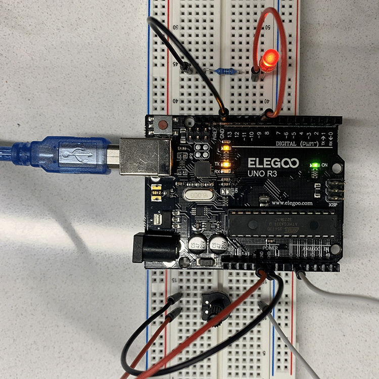

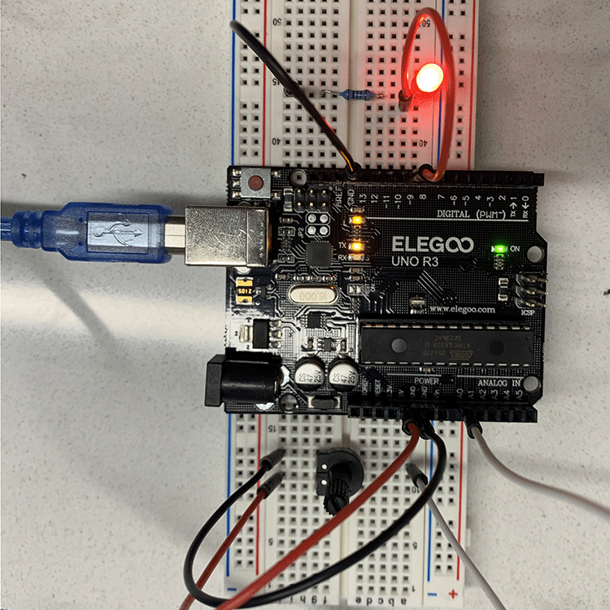

### 5: Light Sensor

## Results

## Conclusion
