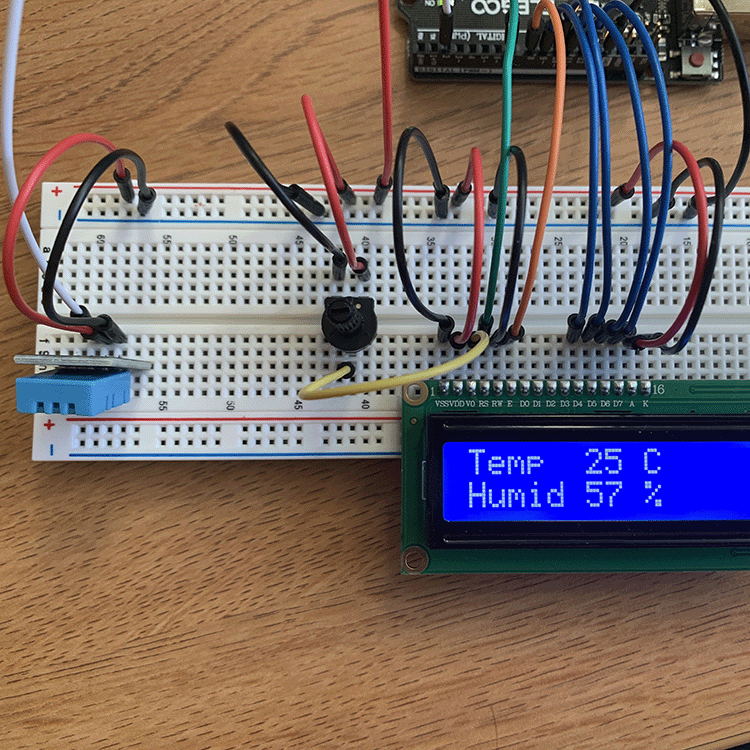
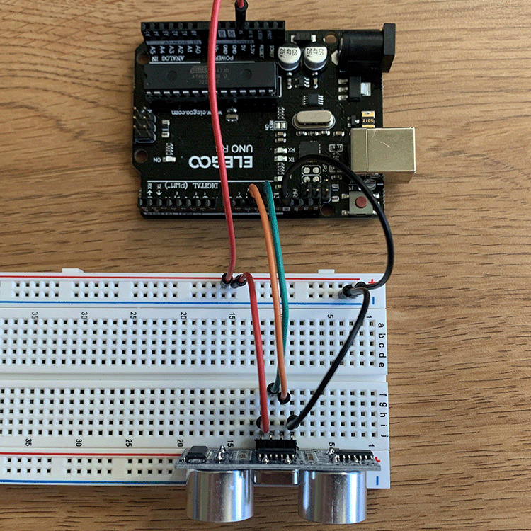
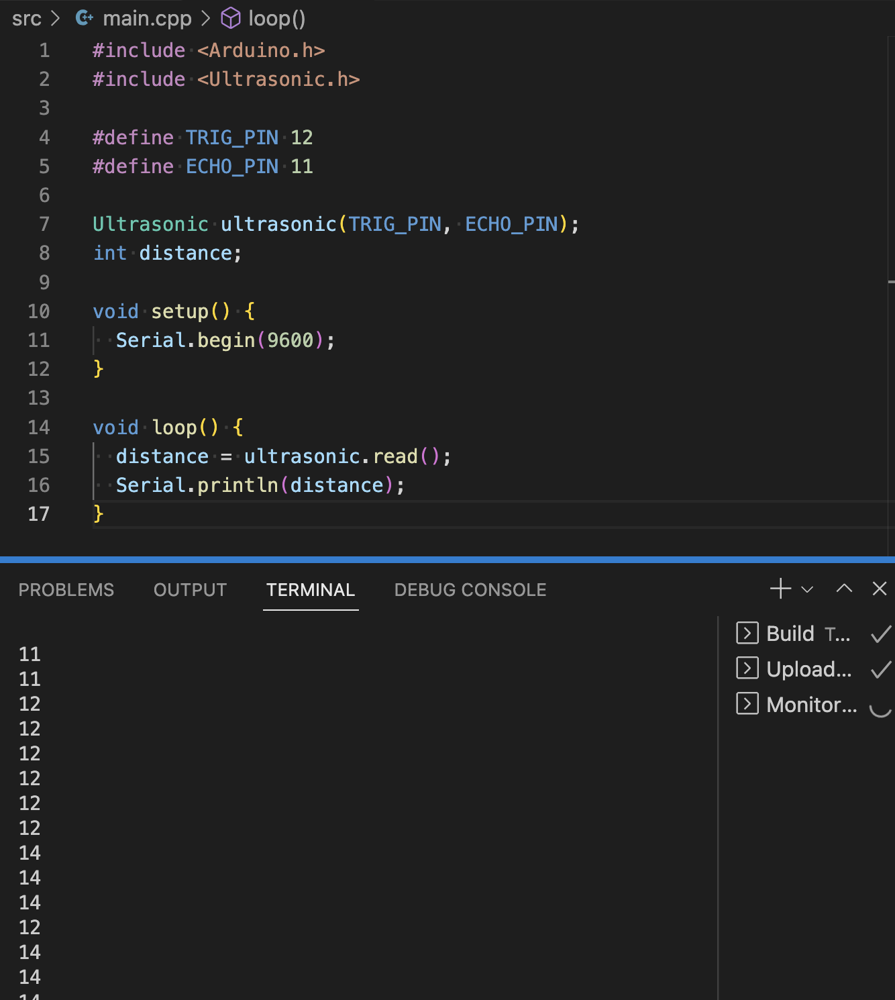
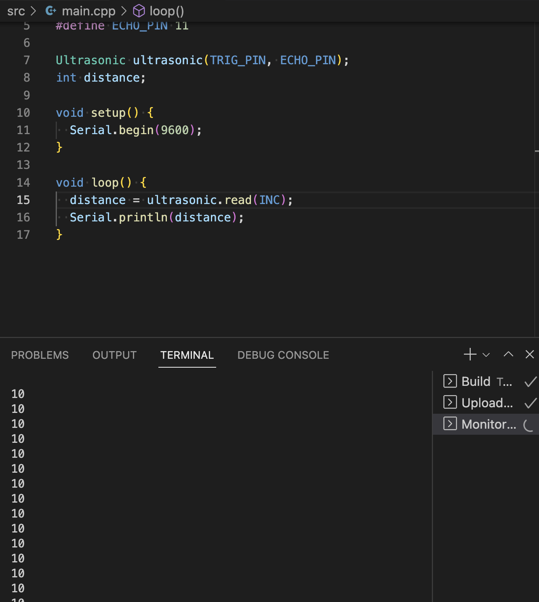

# Lab 6 - Sensors - February 04, 2023

Using composite temperature/humidity sensor and ultrasonic proximity sensor with Arduino UNO

## Prep

* To begin, I read through the admittedly daunting lab document to grasp the scope of the excercises.

* I learned that **DHT** stands for **Digital Temperature and Humidity Sensor**

* The lab doc said that I should use the previous lab's code as the foundation for this lab, but I like having seperate files for each lab, so I made a new PIO project, added the LiquidCrystal Library, and copied the lab 5 code.

* I loaded Olewolf's DHT Nonblocking Library to my project

## Process

### 1: DHT11 Temperature / Humidity Sensor

* I replaced the old contents of main.cpp with the gist from the lab doc and it built successfully.

* To finish preparing, I wired my breadboard to incorporate the DHT11 Sensor

* After uploading, I had success!

* Unfortunately, I can not begin to imagine which part of the code I would edit the unit that the temperature is displayed in, nor how to create an if statement to comment based on weather conditions. I will think on this over the weekend, but as of now, I am going to move towards the second lab excercise.

### 2: Ultrasonic Proximity Sensor

* I disconnected the previous breadboard setup, replacing it with the neccessary wiring for the ultrasonic sensor

* I copied, built, and uploaded the code, successfully and accurately displaying distance in cm in the serial monitor.

* Then, I tested out switching the unit to inches.

