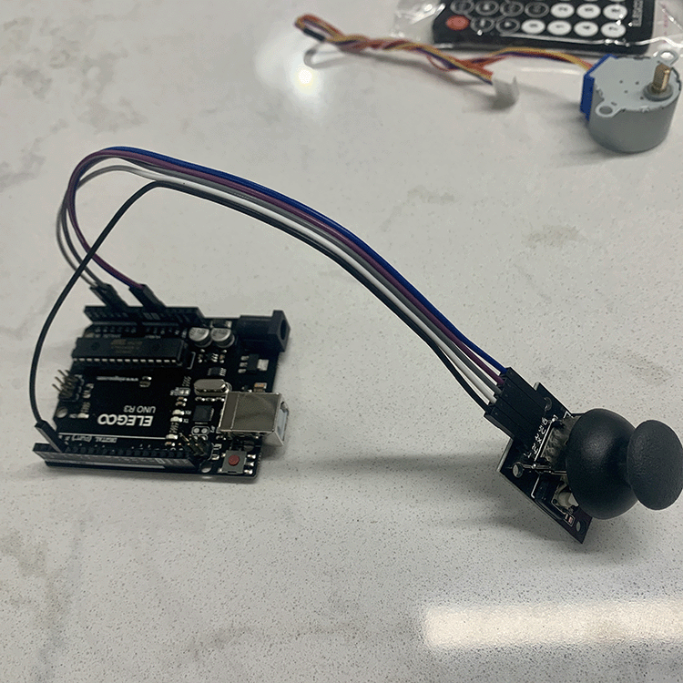
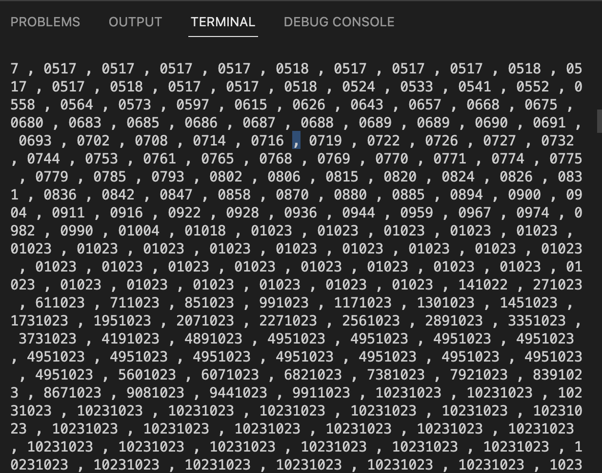
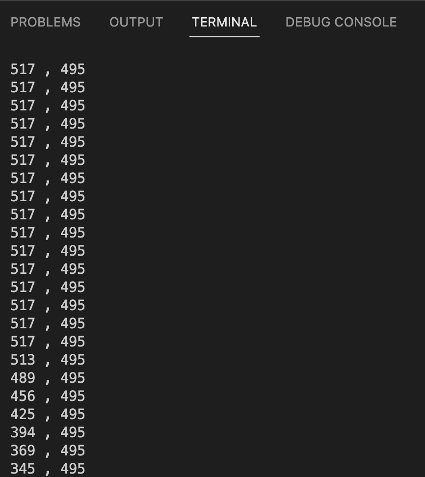
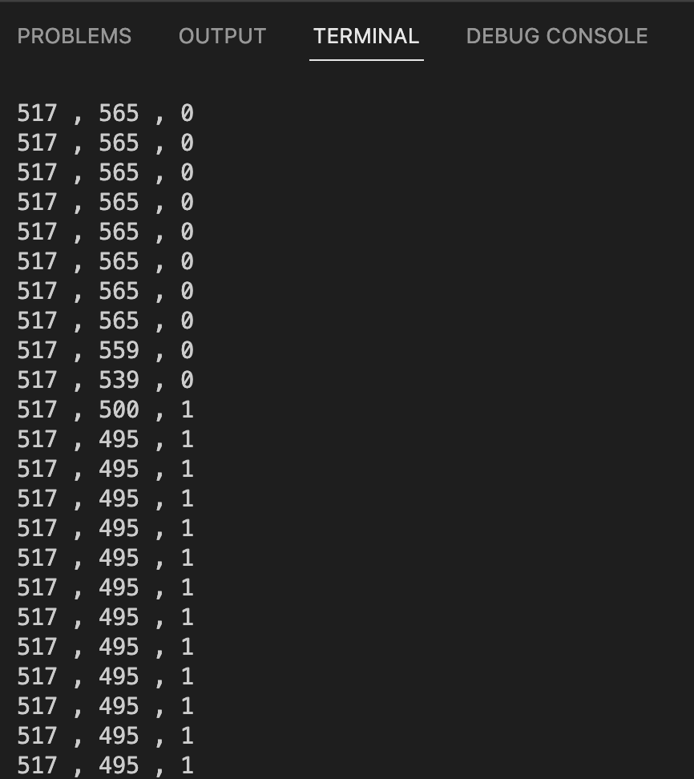
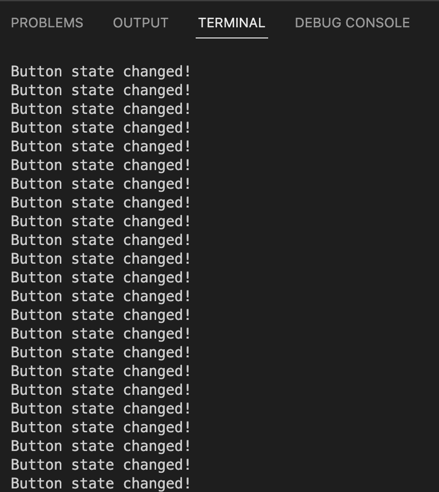
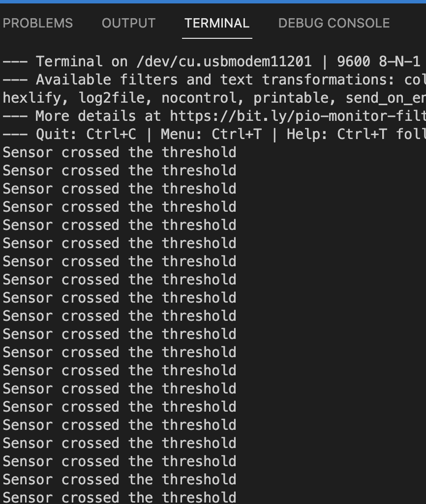

# Lab 7 - Sensor Changes - February 07, 2023

Connecting the joystick to arduino, responding to changes in sensor data, writing with specific instead of constant serial data

## Prep

Some notes from reviewing the lab doc:

* **Joystick:** Potentiometer for both X and Y axis, switch for pushbutton.
* **Joystick** to **Arduino**
* GND > GND
* +5V > 5V
* VRx > A0
* VRy > A1
* SW  > D3

## Process

### Excercise 1: Reading potentiometer and switch data from the joystick

* I connected the joystick to the arduino, copied the code from the lab doc, built, and uploaded it.

* The serial monitor started printing an endless barage of data values

* Upon further inspection, I realised that I had mistakenly omitted "ln" the last "Serial.print" function, creating that error. With that fixed, the serial monitor started displaying accurate data.

* It became obvious to me that the origin is not in the center "resting" state of the joystick, but actually in the upper left corner, as with p5js...

* With that said, I can make the assumption that the X axis actually accounts for more range of motion than the y axis.

* **Pullup Resistor:** Alleviates "floating" pins by "pulling" the pin to HIGH when the switch isn't activated
  
* The arduino contains an on-board pullup resistor, activated by INPUT_PULLUP

* Next, I copied the remaining code to read the switch.

### Excersise 2: Responding to Changes in the State of a Sensor

* I read through the code a few times, noticing that this function will endlessly repeat, constantly setting the last button state as the current, potentially voiding the if/ statement? I will see when I upload the code.

* While my prior assumption was incorrect, I am still occasionally getting multiple messages when I press the button, but not when I release. Perhaps this is because the switch is sending over a steady data stream while its pressed, tricking the code into thinking that there are multiple presses happening?

* I assumed that I could set a second parameter in the if statement requiring the button state to be LOW in order to print the message, but it gave me an error as if buttonState couldn't be used twice in the same if statement.

### Excercise 3: Analog Input Threshold

* This excercise makes a degree of intuitive sense to me, and the code is laid out in a way where I feel like I could easily integrate it with my own project.

* I copied the code, and it worked.

## Conclusion

* Going forward, I would like to refine my understanding of if statements. They're one of the most powerful ways to integrate booleans into your code and get a lot of response and interconnected processes. They confused me last semester, and they still confuse me this semester.

* How would I go about finishing the extra tast in excercise 2? How can I check multiple parameters in a single if function?
* 