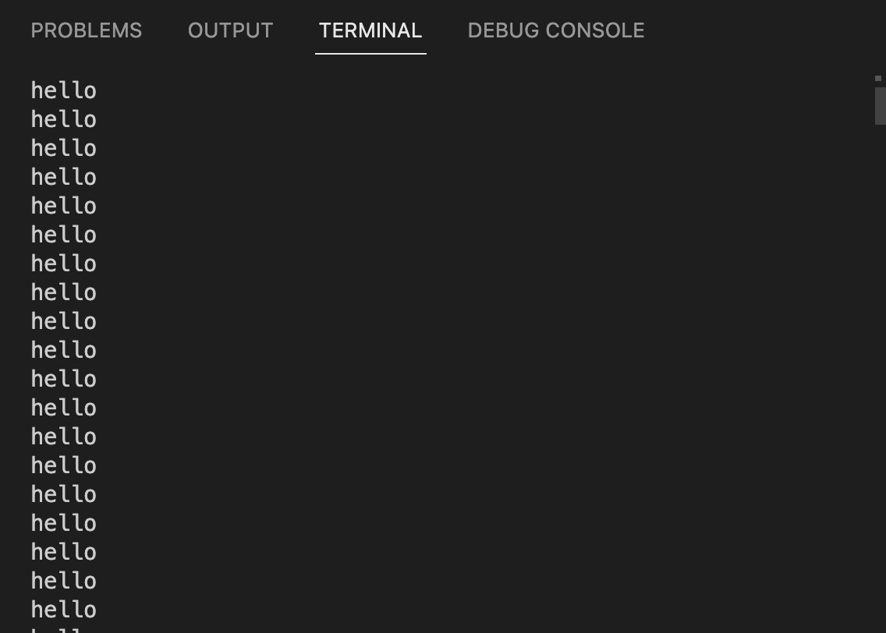
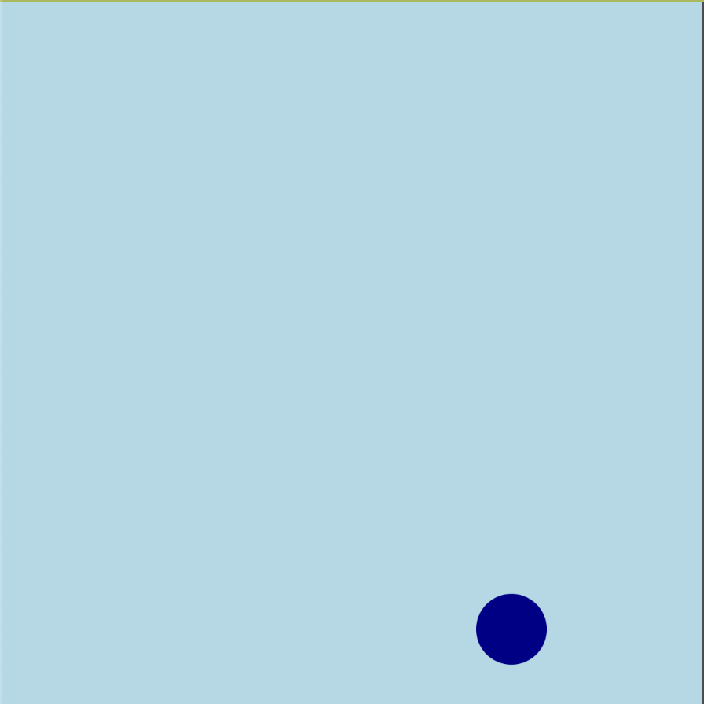
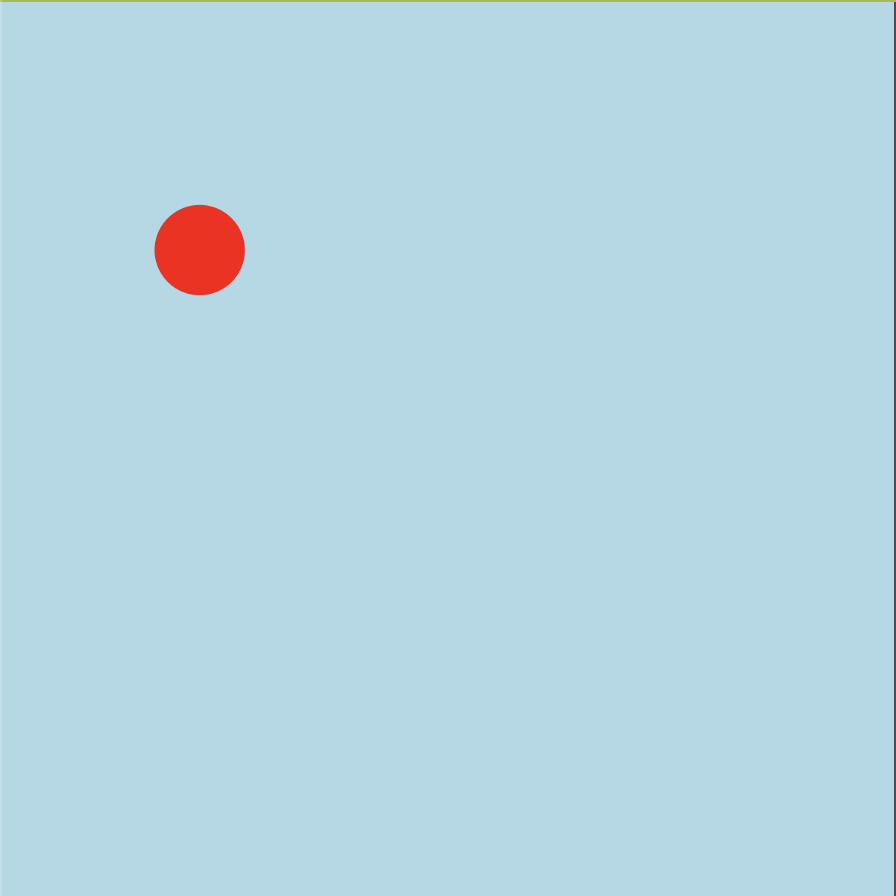
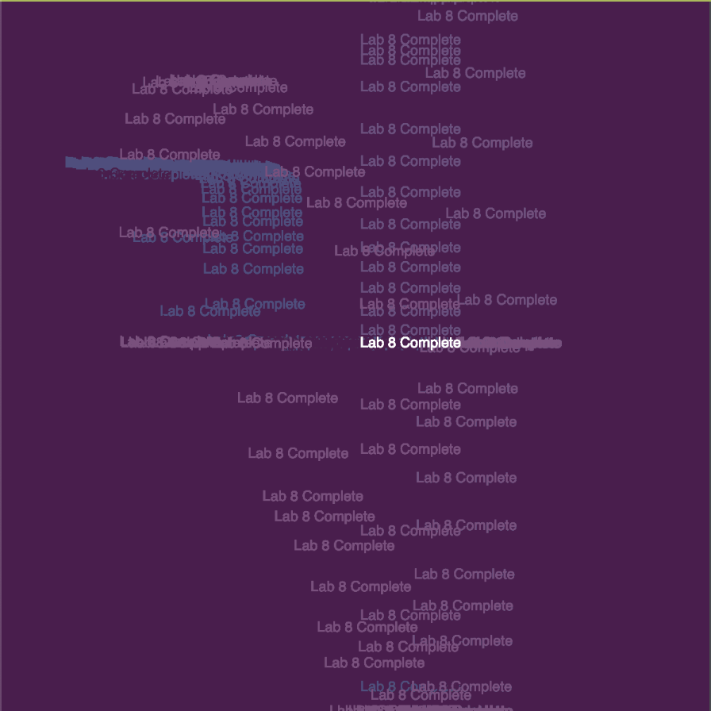
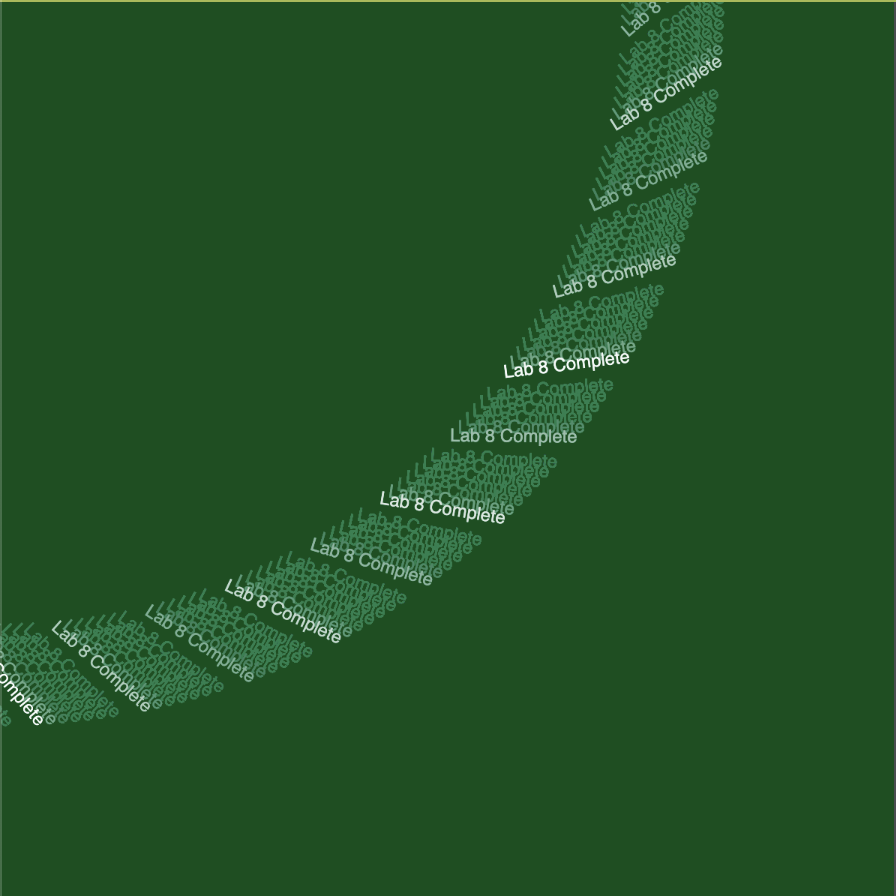

# Lab 8 - Web Serial - February 09, 2023

Creating call-and-response communication between Arduino UNO and p5js sketch

## Prep

* After reading through the lab doc, there doesn't seem to be too much in this lab that will be unfamiliar to me. It will be a good refresher for working with p5js.

* Instead of sending constant serial data, the p5js sketch requsts chunks of data from the arduino as quickly as it can process the previous chunk.

## Process

* I cloned the [p5js template](https://github.com/CraigMoore3/lab8p5js) from the doc.

* The serialFunction.js document seems to house the foundation for each of the serial functions in sketch.js. Some of them make intuitive sense, like makePortButton and portError, but choosePort does not. It doesn't look like any if statement I've encountered so far.

* I had to reconnect the joystick to the arduino, which was made very easy by my prior documentation. There just might be something to this....

* After copying the Platform.io code, I noticed a lot that looked familiar from the previous lab. There is still a sensor variable being checked for each pin in the "loop" section. What I don't understand is how the same variable name (sensorValue) can be used for three seperate pins. Perhaps it will be more clear after uploading.

* After uploading, the serial monitor was displaying the correct information ("hello" repeating endlessly), and the TX light was flashing.

* Upon first attempt at viewing the p5js sketch in Chrome, I ran into some issues. I was able to choose a port, but the sketch was not being manipulated by my input on the joy stick.

* Aha! I had the Serial Monitor still open in VSC, which was preventing the browser from reading the serial data.

* At this point, the p5js sketch was accurately pulling from WebSerial data, reflecting the positioning and status of the button in the sketch.

* Next, I started messing with the p5js sketch to see what kind of results I could get.

## Conclusion

* Ultimately, this lab served as a good reintroduction to sketching with p5js and a solid introduction to WebSerial. I am interested in learning more about different approaches to using WebSerial, outside of p5js, as I think you could use the arduino to create the opportunity for some very interesting input/output relationships. It would be cool to have a "living, breathing" sketch that runs for days and responds to different environmental factors. I almost want to experiment with making a "virtual pet" that requires a certain set of real-world conditions (light, temperature, etc) to survive.

* I still want to understand more about what is happening in serialFunction.js

* Also, how are we able to use the same sensorValue variable to track multiple types of data?
